### Filtro

##### Diagrama Relacional

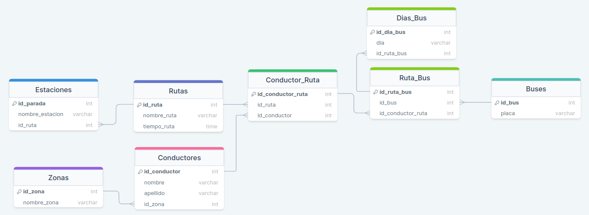

### Consultas

##### 1. Cantidad de Paradas por Ruta.

  ```sql
  SELECT COUNT(*) AS 'Paradas por Ruta', r.nombre_ruta FROM Estaciones e 
  JOIN Rutas r ON e.id_ruta = r.id_ruta
  GROUP BY e.id_ruta;
  ```

##### Resultado

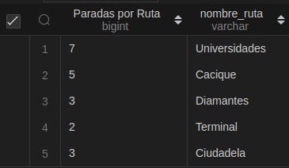

##### 2. Nombre de las Paradas de la Ruta Universidades.

  ```sql
  SELECT e.nombre_estacion, r.nombre_ruta FROM Estaciones e 
  JOIN Rutas r ON e.id_ruta = r.id_ruta
  WHERE r.id_ruta = 1;  
  ```

##### Resultado

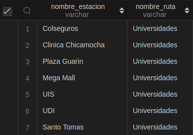

##### 3. Nombres de las Rutas No Programadas.(ACLARACION: Hay rutas programadas sin estaciones, ¿Eso se considera programadas? Aqui la diferencia)

Rutas no programadas y sin estaciones.

  ```sql
  SELECT r.nombre_ruta, e.id_ruta AS Programadas FROM Rutas r
  LEFT JOIN Estaciones e ON e.id_ruta = r.id_ruta
  WHERE e.id_ruta IS NULL;
  ```

##### Resultado

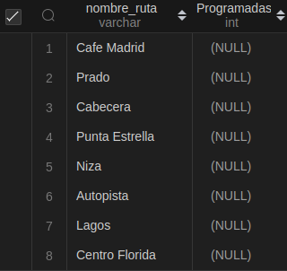

Rutas no programadas.

  ```sql
  SELECT r.nombre_ruta, cr.id_ruta AS Programadas FROM Rutas r
  LEFT JOIN Conductor_Ruta cr ON cr.id_ruta = r.id_ruta
  WHERE cr.id_ruta IS NULL;
  ```

##### Resultado

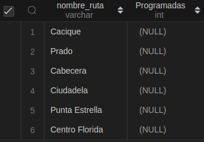

##### 4. Rutas Programadas sin Conductor Asignado.

Rutas Programadas que tienen estaciones:

  ```sql
  SELECT DISTINCT r.nombre_ruta, cr.id_conductor AS Conductor FROM Rutas r
  JOIN Estaciones e ON e.id_ruta = r.id_ruta
  LEFT JOIN Conductor_Ruta cr ON cr.id_ruta = r.id_ruta
  WHERE cr.id_conductor IS NULL;
  ```

##### Resultado

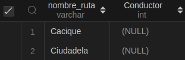

##### 5. Conductores No Asignados a la Programación.

  ```sql
  SELECT DISTINCT c.id_conductor, c.nombre, c.apellido, cr.id_conductor AS Asignado 
  FROM Conductores c
  LEFT JOIN Conductor_Ruta cr ON cr.id_conductor = c.id_conductor
  WHERE cr.id_conductor IS NULL;
  ```

##### Resultado

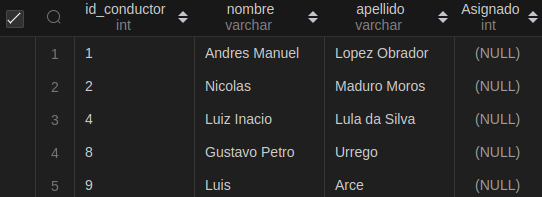

##### 6. Buses No asignados a la Programación.

  ```sql
  SELECT DISTINCT b.id_bus, b.placa, br.id_bus AS Asignado FROM Buses b
  LEFT JOIN Ruta_Bus br ON br.id_bus = b.id_bus
  WHERE br.id_bus IS NULL;
  ```

##### Resultado

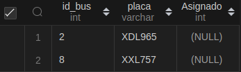


##### 7. Zonas NO Programadas.

  ```sql
  SELECT z.id_zona, z.nombre_zona, c.id_zona AS Programadas FROM Zonas z
  LEFT JOIN Conductores c ON c.id_zona = z.id_zona
  WHERE c.id_zona IS NULL;
  ```

##### Resultado

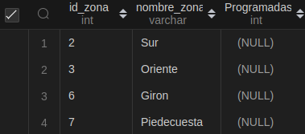

##### 8. Programación asignada a cada conductor (Conductor, Ruta y Día).

  ```sql
  SELECT c.nombre, c.apellido, r.nombre_ruta, db.dia FROM Conductores c
  JOIN Conductor_Ruta cr ON cr.id_conductor = c.id_conductor
  JOIN Rutas r ON r.id_ruta = cr.id_ruta
  JOIN Ruta_Bus rb ON rb.id_conductor_ruta = cr.id_conductor_ruta
  JOIN Dias_Bus db ON db.id_ruta_bus = rb.id_ruta_bus;
  ```

##### Resultado

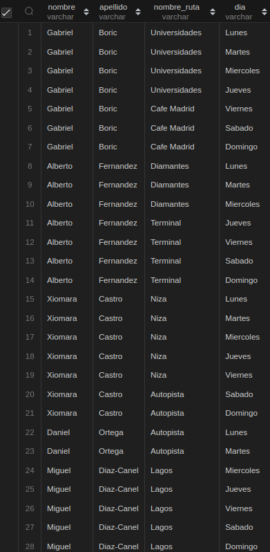

##### 9. Programación asignada a conductores que hacen rutas de más de dos horas.

  ```sql
  SELECT c.nombre, c.apellido, r.nombre_ruta, r.tiempo_ruta FROM Conductores c
  JOIN Conductor_Ruta cr ON cr.id_conductor = c.id_conductor
  JOIN Rutas r ON r.id_ruta = cr.id_ruta
  WHERE r.tiempo_ruta > 2;
  ```

##### Resultado

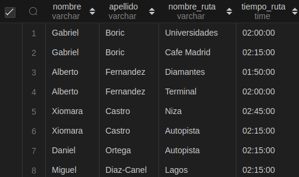

##### 10. Nombres de Zonas y cantidad de rutas que tienen programadas (Contar).

  ```sql
  SELECT z.id_zona, z.nombre_zona, COUNT(r.id_ruta) AS Cantidad_Rutas FROM Zonas z
  JOIN Conductores c ON c.id_zona = z.id_zona
  JOIN Conductor_Ruta cr ON cr.id_conductor = c.id_conductor
  JOIN Rutas r ON r.id_ruta = cr.id_ruta
  GROUP BY z.id_zona;
  ```

##### Resultado

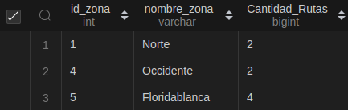